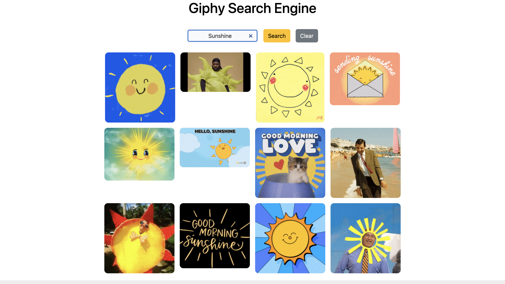

# Giphy Search Engine

## Description

A Fun and Interactive GIF Search Experience

Explore a dynamic world of animated GIFs, powered by the Giphy API. This project brings a lighthearted and engaging way to search and discover GIFs across various categories. Whether it’s for entertainment, reactions, or inspiration, the Giphy Search Engine ensures every search returns a delightful visual experience.

With its simple and intuitive interface, users can search for GIFs by keyword, explore trending options, and easily share their favorites. This project emphasizes usability and performance, offering fast and smooth interaction.

## Wireframes

## Technologies Used

- HTML
- CSS
- JavaScript
- Giphy API

## User Stories

1. **As a user**, I want to search for GIFs using keywords so that I can find relevant animations for my needs.
2. **As a user**, I want to be able to clear the search bar so that I can search something else.
3. **As a user**, I want to be able to use it both on the phone and web.

## Screen Shots

## Next Steps

1. Implement **user accounts** to allow saving favorite GIFs across sessions.
2. Add **infinite scrolling** to improve the browsing experience when searching through large results.
3. Include **dark mode** to enhance the usability for users browsing at night.
4. **Optimize API requests** to improve load time and minimize data usage.

## Author

Deji Taiwo - [@LinkedIn](https://www.linkedin.com/in/taiwo-a-80346223b/)
